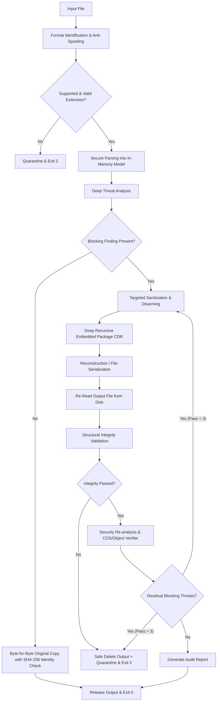
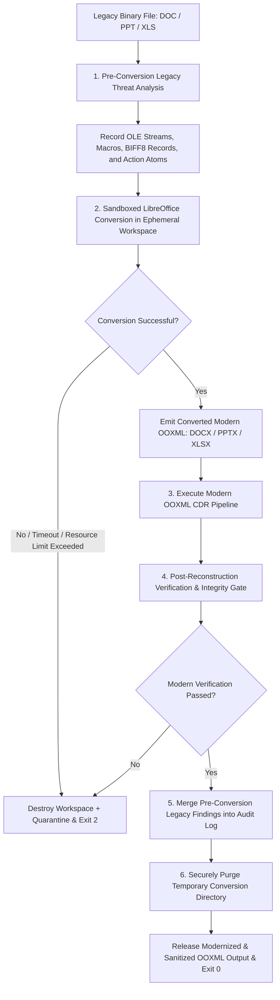

# DocShield CDR (Content Disarm and Reconstruction)

[](https://openjdk.org/projects/jdk/21/)
[]()
[]()

DocShield is a high-assurance **Content Disarm and Reconstruction (CDR)** engine engineered to protect enterprise boundaries from file-borne malware, weaponized document exploits, malicious macros, script execution chains, external data exfiltration pipes, and archive-layer evasion techniques.

---

## 1. What is DocShield?

Traditional Antivirus (AV) and Endpoint Detection & Response (EDR) solutions rely predominantly on signature matching, heuristic emulation, or known Indicators of Compromise (IoCs). Attackers routinely bypass these defenses through polymorphic macros, VBA stomping, novel shellcode encodings, zero-day parser exploits, and fragmented XML instructions.

**Content Disarm and Reconstruction (CDR)** operates on a fundamentally different security paradigm:
- **Zero Trust File Ingestion**: All incoming files are treated as hostile, regardless of origin.
- **Capability-Based Threat Detection**: Rather than searching for known malware family names (e.g., *Emotet*, *Qakbot*), DocShield detects **dangerous capabilities** (e.g., dynamic DDE process execution, XLM macro sheets, embedded native executables, external template hijacking, unverified OLE storages, PDF JavaScript engines, and external URI handlers).
- **Deep Decomposition & Sanitization**: Documents are unpacked into structured, in-memory object graphs. Threat-bearing parts, relationship references, and malicious XML/COS tags are surgically removed while preserving benign text, formatting, images, tables, and visual presentation.
- **Strict Reconstruction & Verification**: The document is reconstructed from sanitized components into a fresh container. It is then re-read from disk and subjected to mandatory post-reconstruction security re-analysis and structural integrity validation before being released.
- **Fail-Closed Security**: If a document contains uninspectable, malformed, or unremovable threats, or if post-reconstruction verification fails, DocShield terminates the release, securely deletes any partial outputs, and safely isolates the original file into an encrypted/timestamped quarantine vault.

---

## 2. Supported Formats

| Format | Extension | Processing Category | Architecture Pipeline | Release Status |
|---|---|---|---|---|
| **Portable Document Format** | `.pdf` | Modern Native | Multi-Pass PDFBox Ingest → Graph Disarm → Isolated Serialization → Post-CDR COS/XRef Verification | **Production Ready** |
| **Word Document (OpenXML)** | `.docx` | Modern Native | Secure ZIP Reader → OPC Graph & Word Field Disarm → In-Memory Recursive CDR → Package Writer → Re-Read Verification | **Production Ready** |
| **PowerPoint Presentation (OpenXML)** | `.pptx` | Modern Native | Secure ZIP Reader → Action/SVG/OLE Disarm → In-Memory Recursive CDR → Package Writer → Re-Read Verification | **Production Ready** |
| **Excel Workbook (OpenXML)** | `.xlsx` | Modern Native | Secure ZIP Reader → XLM/DDE/Formula Disarm → In-Memory Recursive CDR → Package Writer → Re-Read Verification | **Production Ready** |
| **Word 97-2003 Binary Document** | `.doc` | Legacy Binary | Pre-Conversion OLE Analysis → Isolated Sandboxed LibreOffice Conversion → Modern DOCX CDR → Final Verification | **Production Ready** |
| **PowerPoint 97-2003 Presentation** | `.ppt` | Legacy Binary | Pre-Conversion OLE/Atom Analysis → Isolated Sandboxed LibreOffice Conversion → Modern PPTX CDR → Final Verification | **Production Ready** |
| **Excel 97-2003 Binary Workbook** | `.xls` | Legacy Binary | Pre-Conversion BIFF8/XLM Analysis → Isolated Sandboxed LibreOffice Conversion → Modern XLSX CDR → Final Verification | **Production Ready** |
| **Rich Text Format** | `.rtf` | Modern Text / Native RTF | RTF structural analysis → Threat Analysis → Surgical Disarm → Reconstruction → Re-Read Integrity/Security Verification | **Integrated** |

> [!IMPORTANT]
> **RTF Scope**: RTF CDR is now integrated. `.rtf` inputs are routed through `RTFCDRProcessor`, which analyzes embedded objects, DDE, external templates, dangerous hyperlinks and remote include constructs, sanitizes blocking content, and performs post-reconstruction integrity/security validation.

---

## 3. High-Level Architecture

### Modern Document Pipeline (`DOCX`, `PPTX`, `XLSX`, `PDF`)

RTF inputs use the dedicated `RTFCDRProcessor` path described in the RTF subsystem documentation; they are not routed through the OOXML pipeline.



### Legacy Office Workflow (`DOC`, `PPT`, `XLS`)



#### Why Pre-Conversion Analysis is Mandatory for Legacy Documents
When an office suite or conversion utility (such as LibreOffice) converts a legacy binary file into modern OOXML, it may silently drop unsupported binary macros, strip malformed OLE streams, or alter embedded payloads without reporting what was removed. If inspection was performed only *after* conversion, the audit trail would show a clean conversion without recording that a malicious VBA payload or DDE link existed in the original file. DocShield's legacy pipeline analyzes the raw OLE2 binary **before** conversion and aggregates those findings into the final disarming report.

---

## 4. Security Philosophy

1. **Capability-Based Detection**: Malicious actors can easily change hash signatures, string names, and binary packers. They cannot change the functional capabilities required to achieve execution (macros, DDE commands, external network connections, embedded PE/script drops, PDF actions). DocShield targets these operational capabilities directly.
2. **Least Trust**: No embedded object, relationship URI, or XML declaration is assumed benign. Embedded packages are recursively unpacked and evaluated down to multiple nested levels.
3. **Fail-Closed by Design**: If an archive is malformed, if an XML stream violates DTD restrictions, if recursion depth limits are exceeded, or if an embedded object format cannot be positively identified, DocShield refuses to release the file and quarantines it.
4. **Uninspectable Content is Hostile**: Content that cannot be safely parsed or decoded (e.g., corrupted PDF streams or unknown embedded binaries) is treated as a security violation rather than being passed through.
5. **Reconstruction is Not Safety**: Creating a new ZIP container or saving a PDF does not automatically render it safe. Sanitization must be validated through independent, post-reconstruction re-analysis.
6. **Separation of Integrity and Security**: A file may be structurally valid but malicious, or secure but corrupted. Both gates ([`OOXMLIntegrityValidator`](file:///d:/CAIR/DOC%20SHIELD/DocShield/cdr/src/main/java/validation/ooxml/OOXMLIntegrityValidator.java) / [`PDFIntegrityValidator`](file:///d:/CAIR/DOC%20SHIELD/DocShield/cdr/src/main/java/validation/pdf/PDFIntegrityValidator.java) and [`OOXMLThreatAnalyzer`](file:///d:/CAIR/DOC%20SHIELD/DocShield/cdr/src/main/java/threat/ooxml/OOXMLThreatAnalyzer.java) / [`PDFSecuritySurfaceVerifier`](file:///d:/CAIR/DOC%20SHIELD/DocShield/cdr/src/main/java/threat/pdf/PDFSecuritySurfaceVerifier.java)) must pass unconditionally.

---

## 5. Threat Detection Coverage Matrix

| Threat / Attack Surface | Detection Class(es) | Evidence / Heuristics Checked | Blocking? | Sanitization Action |
|---|---|---|---|---|
| **VBA Macro Projects** | [`OOXMLThreatAnalyzer`](file:///d:/CAIR/DOC%20SHIELD/DocShield/cdr/src/main/java/threat/ooxml/OOXMLThreatAnalyzer.java), [`DOCXThreatAnalyzer`](file:///d:/CAIR/DOC%20SHIELD/DocShield/cdr/src/main/java/threat/docx/DOCXThreatAnalyzer.java), [`PPTXThreatAnalyzer`](file:///d:/CAIR/DOC%20SHIELD/DocShield/cdr/src/main/java/threat/pptx/PPTXThreatAnalyzer.java), [`XLSXThreatAnalyzer`](file:///d:/CAIR/DOC%20SHIELD/DocShield/cdr/src/main/java/threat/xlsx/XLSXThreatAnalyzer.java) | `vbaProject.bin`, `vbaData.xml`, macro relationships, macro content types | **Yes** (`THREAT`) | Physical binary part removed, relationship severed, `[Content_Types].xml` pruned |
| **ActiveX Controls** | [`OOXMLThreatAnalyzer`](file:///d:/CAIR/DOC%20SHIELD/DocShield/cdr/src/main/java/threat/ooxml/OOXMLThreatAnalyzer.java) | `activeX*.xml`, `activeX*.bin`, `ctrlProps/` | **Yes** (`THREAT`) | Control parts and incoming relationships deleted |
| **OLE Compound Objects** | [`OLEAnalyzer`](file:///d:/CAIR/DOC%20SHIELD/DocShield/cdr/src/main/java/threat/ooxml/OLEAnalyzer.java), [`Ole10NativeAnalyzer`](file:///d:/CAIR/DOC%20SHIELD/DocShield/cdr/src/main/java/threat/pptx/Ole10NativeAnalyzer.java) | OLE header `D0 CF 11 E0 A1 B1 1A E1`, directory entries, `\x01Ole10Native` streams | **Yes** (`THREAT` if unsafe/exec; `OBSERVATION` if benign) | Unsafe OLE parts removed; nested OOXML recursively disarmed |
| **PE Executables** | [`OLEAnalyzer`](file:///d:/CAIR/DOC%20SHIELD/DocShield/cdr/src/main/java/threat/ooxml/OLEAnalyzer.java), [`PayloadIdentifier`](file:///d:/CAIR/DOC%20SHIELD/DocShield/cdr/src/main/java/threat/pptx/PayloadIdentifier.java) | `MZ` header **and** verified `PE\0\0` signature at DWORD `e_lfanew` (offset `0x3C`) | **Yes** (`THREAT`) | Part deleted; relationship stripped |
| **ELF Executables** | [`PayloadIdentifier`](file:///d:/CAIR/DOC%20SHIELD/DocShield/cdr/src/main/java/threat/pptx/PayloadIdentifier.java) | `\x7FELF` magic bytes | **Yes** (`THREAT`) | Part deleted; relationship stripped |
| **Mach-O Executables** | [`PayloadIdentifier`](file:///d:/CAIR/DOC%20SHIELD/DocShield/cdr/src/main/java/threat/pptx/PayloadIdentifier.java) | `0xFEEDFACE`, `0xFEEDFACF`, `0xCEFAEDFE`, `0xCFFAEDFE` | **Yes** (`THREAT`) | Part deleted; relationship stripped |
| **Script Payloads** | [`PayloadIdentifier`](file:///d:/CAIR/DOC%20SHIELD/DocShield/cdr/src/main/java/threat/pptx/PayloadIdentifier.java) | Shebang `#!`, PowerShell tokens, batch markers (`@echo off`), VBScript, HTML/JS | **Yes** (`THREAT`) | Part deleted; relationship stripped |
| **EICAR Test Signatures** | [`PayloadIdentifier`](file:///d:/CAIR/DOC%20SHIELD/DocShield/cdr/src/main/java/threat/pptx/PayloadIdentifier.java), [`PDFStreamThreatInspector`](file:///d:/CAIR/DOC%20SHIELD/DocShield/cdr/src/main/java/threat/pdf/PDFStreamThreatInspector.java) | Standard EICAR standard anti-virus test string | **Yes** (`THREAT`) | Part/stream sanitized or removed |
| **Dynamic Data Exchange (DDE/DDEAUTO)** | [`DOCXThreatAnalyzer`](file:///d:/CAIR/DOC%20SHIELD/DocShield/cdr/src/main/java/threat/docx/DOCXThreatAnalyzer.java), [`XLSXThreatAnalyzer`](file:///d:/CAIR/DOC%20SHIELD/DocShield/cdr/src/main/java/threat/xlsx/XLSXThreatAnalyzer.java) | Fragmented `w:instrText` DDE tokens, Excel `cmd\|/C ...!A0` formulas | **Yes** (`THREAT`) | Word field instruction stripped (cached text kept); Excel formula and `<v>` cached value purged |
| **XLM (Excel 4.0) Macros** | [`XLSXThreatAnalyzer`](file:///d:/CAIR/DOC%20SHIELD/DocShield/cdr/src/main/java/threat/xlsx/XLSXThreatAnalyzer.java) | `xl/macrosheets/sheet*.xml`, macro sheet content types | **Yes** (`THREAT`) | Macro sheet part removed, workbook sheet reference deleted |
| **Active / Dangerous Excel Formulas** | [`XLSXThreatAnalyzer`](file:///d:/CAIR/DOC%20SHIELD/DocShield/cdr/src/main/java/threat/xlsx/XLSXThreatAnalyzer.java) | `RTD(`, `CALL(`, `REGISTER.ID(`, `EXEC(`, `RUN(`, `GET.CELL(`, `WEBSERVICE(`, `FILTERXML(` | **Yes** (`POLICY_VIOLATION` / `THREAT`) | Formula `<f>` stripped from worksheet cells and `<definedName>` elements; cached `<v>` result preserved |
| **External Workbook Links** | [`XLSXThreatAnalyzer`](file:///d:/CAIR/DOC%20SHIELD/DocShield/cdr/src/main/java/threat/xlsx/XLSXThreatAnalyzer.java) | `xl/externalLinks/`, formulas referencing `[Book.xlsx]Sheet!A1` | **Yes** (`POLICY_VIOLATION`) | Dedicated link parts removed, external formulas stripped (cached values kept) |
| **External Data Connections** | [`XLSXThreatAnalyzer`](file:///d:/CAIR/DOC%20SHIELD/DocShield/cdr/src/main/java/threat/xlsx/XLSXThreatAnalyzer.java), [`DOCXThreatAnalyzer`](file:///d:/CAIR/DOC%20SHIELD/DocShield/cdr/src/main/java/threat/docx/DOCXThreatAnalyzer.java) | `xl/connections.xml`, `xl/queryTables/`, Word `<w:mailMerge>` blocks | **Yes** (`POLICY_VIOLATION`) | Dedicated connection parts and mail merge blocks stripped |
| **Dangerous URI Protocols** | [`OOXMLThreatAnalyzer`](file:///d:/CAIR/DOC%20SHIELD/DocShield/cdr/src/main/java/threat/ooxml/OOXMLThreatAnalyzer.java), [`PDFThreatAnalyzer`](file:///d:/CAIR/DOC%20SHIELD/DocShield/cdr/src/main/java/threat/pdf/PDFThreatAnalyzer.java) | `file:`, `javascript:`, `vbscript:`, `data:`, `ms-app:`, `shell:`, `mk:`, UNC paths `\\server\share` | **Yes** (`THREAT` / `POLICY_VIOLATION`) | Dangerous relationship severed / PDF action stripped; benign `http:`, `https:`, `mailto:` preserved |
| **External Word Fields** | [`DOCXThreatAnalyzer`](file:///d:/CAIR/DOC%20SHIELD/DocShield/cdr/src/main/java/threat/docx/DOCXThreatAnalyzer.java) | `INCLUDE`, `INCLUDETEXT`, `INCLUDEPICTURE`, `LINK`, `IMPORT` | **Yes** (`POLICY_VIOLATION`) | Field instruction stripped; cached display runs preserved |
| **Attached Templates** | [`DOCXThreatAnalyzer`](file:///d:/CAIR/DOC%20SHIELD/DocShield/cdr/src/main/java/threat/docx/DOCXThreatAnalyzer.java) | Remote attached template relationships | **Yes** (`POLICY_VIOLATION`) | Attached template relationship severed, `word/settings.xml` reference removed |
| **Alternative Format Chunks (`altChunk`)** | [`DOCXThreatAnalyzer`](file:///d:/CAIR/DOC%20SHIELD/DocShield/cdr/src/main/java/threat/docx/DOCXThreatAnalyzer.java) | `http://schemas.openxmlformats.org/officeDocument/2006/relationships/aFChunk` | **Yes** (`POLICY_VIOLATION`) | Part and relationship removed |
| **PowerPoint Interactive Actions** | [`PPTXThreatAnalyzer`](file:///d:/CAIR/DOC%20SHIELD/DocShield/cdr/src/main/java/threat/pptx/PPTXThreatAnalyzer.java) | `<a:hlinkClick>`/`<a:hlinkHover>` with `ppaction://program`, `ppaction://macro`, `ppaction://ole` | **Yes** (`THREAT`) | Action elements, attributes, and action relationships deleted |
| **Suspicious SVG Active Content** | [`PPTXThreatAnalyzer`](file:///d:/CAIR/DOC%20SHIELD/DocShield/cdr/src/main/java/threat/pptx/PPTXThreatAnalyzer.java) | SVG parts containing `<script>` or event handlers (`onload`, `onclick`) | **Yes** (`THREAT`) | SVG part and image relationship deleted |
| **PDF JavaScript** | [`PDFThreatAnalyzer`](file:///d:/CAIR/DOC%20SHIELD/DocShield/cdr/src/main/java/threat/pdf/PDFThreatAnalyzer.java), [`PDFSecuritySurfaceVerifier`](file:///d:/CAIR/DOC%20SHIELD/DocShield/cdr/src/main/java/threat/pdf/PDFSecuritySurfaceVerifier.java) | `/Names -> /JavaScript`, `/S /JavaScript` actions | **Yes** (`THREAT`) | JavaScript name tree and action dictionaries deleted |
| **PDF Launch & Unsafe Actions** | [`PDFThreatAnalyzer`](file:///d:/CAIR/DOC%20SHIELD/DocShield/cdr/src/main/java/threat/pdf/PDFThreatAnalyzer.java) | `/S /Launch`, `/GoToR`, `/GoToE`, `/SubmitForm`, `/ImportData`, `/RichMediaExecute` | **Yes** (`THREAT`) | Action entries removed from catalog and page annotations |
| **PDF Embedded Files & Attachments** | [`PDFThreatAnalyzer`](file:///d:/CAIR/DOC%20SHIELD/DocShield/cdr/src/main/java/threat/pdf/PDFThreatAnalyzer.java), [`PDFEmbeddedPayloadInspector`](file:///d:/CAIR/DOC%20SHIELD/DocShield/cdr/src/main/java/threat/pdf/PDFEmbeddedPayloadInspector.java) | `/Names -> /EmbeddedFiles`, `/Subtype /FileAttachment` annotations | **Yes** (`POLICY_VIOLATION` / `THREAT`) | Embedded file name trees and annotation dictionaries deleted |
| **PDF RichMedia & 3D Objects** | [`PDFThreatAnalyzer`](file:///d:/CAIR/DOC%20SHIELD/DocShield/cdr/src/main/java/threat/pdf/PDFThreatAnalyzer.java) | `/Subtype /RichMedia`, `/Subtype /3D`, `/Subtype /Movie`, `/Subtype /Sound` | **Yes** (`POLICY_VIOLATION`) | Multimedia annotations deleted from page annotation arrays |
| **PDF XFA Forms** | [`PDFThreatAnalyzer`](file:///d:/CAIR/DOC%20SHIELD/DocShield/cdr/src/main/java/threat/pdf/PDFThreatAnalyzer.java) | `Catalog -> /AcroForm -> /XFA` | **Yes** (`POLICY_VIOLATION`) | `/XFA` dictionary entry deleted; static AcroForm fields retained |
| **PDF Stream Payload Signatures** | [`PDFStreamThreatInspector`](file:///d:/CAIR/DOC%20SHIELD/DocShield/cdr/src/main/java/threat/pdf/PDFStreamThreatInspector.java) | Stream decoders inspect for uncompressed/compressed PE, ELF, Mach-O, scripts, EICAR | **Yes** (`THREAT`) | Detected stream triggers fail-closed quarantine |
| **Malformed / Malicious XML** | [`OOXMLThreatAnalyzer`](file:///d:/CAIR/DOC%20SHIELD/DocShield/cdr/src/main/java/threat/ooxml/OOXMLThreatAnalyzer.java), [`SecureXmlFactory`](file:///d:/CAIR/DOC%20SHIELD/DocShield/cdr/src/main/java/security/sandbox/SecureXmlFactory.java) | `<!DOCTYPE>` declarations, external `<!ENTITY>` definitions, billion laughs patterns | **Yes** (`THREAT`) | `<!DOCTYPE>` and entity blocks stripped; custom entity references pruned |
| **Malformed / Dangling Relationships** | [`OOXMLThreatAnalyzer`](file:///d:/CAIR/DOC%20SHIELD/DocShield/cdr/src/main/java/threat/ooxml/OOXMLThreatAnalyzer.java), [`OOXMLIntegrityValidator`](file:///d:/CAIR/DOC%20SHIELD/DocShield/cdr/src/main/java/validation/ooxml/OOXMLIntegrityValidator.java) | Missing targets, duplicate relationship IDs, relative paths escaping root | **Yes** (`POLICY_VIOLATION`) | Invalid relationships removed; dangling XML references stripped |
| **Archive Zip Slip / Unsafe Paths** | [`PathSandbox`](file:///d:/CAIR/DOC%20SHIELD/DocShield/cdr/src/main/java/security/sandbox/PathSandbox.java), [`OOXMLPackageReader`](file:///d:/CAIR/DOC%20SHIELD/DocShield/cdr/src/main/java/parsing/ooxml/OOXMLPackageReader.java) | ZIP entry paths containing `..`, leading `/`, drive prefixes `C:`, null bytes `\0` | **Yes** (`THREAT`) | Package read aborted; input quarantined |
| **Duplicate ZIP Entries** | [`OOXMLPackageReader`](file:///d:/CAIR/DOC%20SHIELD/DocShield/cdr/src/main/java/parsing/ooxml/OOXMLPackageReader.java) | Case-insensitive duplicate entry names inside same ZIP container | **Yes** (`THREAT`) | Package read rejected; input quarantined |
| **Archive Decompression Bombs** | [`OOXMLPackageReader`](file:///d:/CAIR/DOC%20SHIELD/DocShield/cdr/src/main/java/parsing/ooxml/OOXMLPackageReader.java), [`RecursiveOOXMLSanitizer`](file:///d:/CAIR/DOC%20SHIELD/DocShield/cdr/src/main/java/sanitization/common/RecursiveOOXMLSanitizer.java) | Exceeding 10,000 ZIP entries, 256 MB total uncompressed, 128 MB single part | **Yes** (`THREAT`) | Read terminated; fail-closed quarantine |
| **Recursive Embedded Documents** | [`RecursiveOOXMLSanitizer`](file:///d:/CAIR/DOC%20SHIELD/DocShield/cdr/src/main/java/sanitization/common/RecursiveOOXMLSanitizer.java) | Nested OOXML packages (e.g., embedded sheet in DOCX) | **Yes** (`THREAT` if unsafe/limit exceeded) | In-memory recursive CDR applied; package removed if remaining unsafe |

---

## 6. DOCX Security Pipeline

### Component Mapping

| Class Path | Class Name | Responsibility | Usage in Pipeline |
|---|---|---|---|
| `parsing.ooxml` | [`OOXMLPackageReader`](file:///d:/CAIR/DOC%20SHIELD/DocShield/cdr/src/main/java/parsing/ooxml/OOXMLPackageReader.java) | Secure ZIP archive ingestion with entry limits and XXE-hardened XML parsers. | Ingests input DOCX and re-reads output DOCX. |
| `threat.docx` | [`DOCXThreatAnalyzer`](file:///d:/CAIR/DOC%20SHIELD/DocShield/cdr/src/main/java/threat/docx/DOCXThreatAnalyzer.java) | Orchestrates shared OOXML analysis and Word-specific field instruction scanning. | Runs pre-sanitization and post-reconstruction analysis. |
| `threat.ooxml` | [`OOXMLThreatAnalyzer`](file:///d:/CAIR/DOC%20SHIELD/DocShield/cdr/src/main/java/threat/ooxml/OOXMLThreatAnalyzer.java) | Evaluates shared OPC structures (VBA, ActiveX, relationships, content types, XML). | Executed by `DOCXThreatAnalyzer`. |
| `threat.ooxml` | [`OLEAnalyzer`](file:///d:/CAIR/DOC%20SHIELD/DocShield/cdr/src/main/java/threat/ooxml/OLEAnalyzer.java) | Scans OLE storages for nested VBA macro streams and native executable payloads. | Inspects `word/embeddings/` parts. |
| `sanitization.docx` | [`DOCXThreatSanitizer`](file:///d:/CAIR/DOC%20SHIELD/DocShield/cdr/src/main/java/sanitization/docx/DOCXThreatSanitizer.java) | Entry point delegating package-level mutation to `OOXMLThreatSanitizer`. | Called by `DOCXCDRProcessor`. |
| `sanitization.common`| [`OOXMLThreatSanitizer`](file:///d:/CAIR/DOC%20SHIELD/DocShield/cdr/src/main/java/sanitization/common/OOXMLThreatSanitizer.java) | Shared graph mutation engine: part deletion, relationship severance, XML cleanup. | Performs surgical disarming of Word packages. |
| `sanitization.common`| [`RecursiveOOXMLSanitizer`](file:///d:/CAIR/DOC%20SHIELD/DocShield/cdr/src/main/java/sanitization/common/RecursiveOOXMLSanitizer.java) | Unpacks, disarms, reconstructs, and re-injects nested embedded OOXML packages. | Processes embedded objects in memory. |
| `reconstruction` | [`OOXMLPackageWriter`](file:///d:/CAIR/DOC%20SHIELD/DocShield/cdr/src/main/java/reconstruction/OOXMLPackageWriter.java) | Dynamically regenerates `[Content_Types].xml` and `.rels`, writing clean ZIP archive. | Serializes sanitized package to disk. |
| `validation.ooxml` | [`OOXMLIntegrityValidator`](file:///d:/CAIR/DOC%20SHIELD/DocShield/cdr/src/main/java/validation/ooxml/OOXMLIntegrityValidator.java) | Structural and relational integrity verification. | Validates re-read output package. |
| `processing.docx` | [`DOCXCDRProcessor`](file:///d:/CAIR/DOC%20SHIELD/DocShield/cdr/src/main/java/processing/docx/DOCXCDRProcessor.java) | End-to-end pipeline orchestrator with bounded 3-pass hardening loop. | Executed by `Main.java`. |

### Word Field Instruction Disarming
Word field instructions can be split across multiple run elements:
```xml
<w:p>
  <w:r><w:fldChar w:fldCharType="begin"/></w:r>
  <w:r><w:instrText xml:space="preserve"> DDEAUTO "C:\\Windows\\System32\\cmd.exe" "/C calc.exe" </w:instrText></w:r>
  <w:r><w:fldChar w:fldCharType="separate"/></w:r>
  <w:r><w:t>Cached Field Result Text</w:t></w:r>
  <w:r><w:fldChar w:fldCharType="end"/></w:r>
</w:p>
```
`OOXMLThreatSanitizer.stripWordFieldInstructions` reconstructs the entire instruction buffer across fragmented `w:instrText` tags within the field region. When a dangerous token (`DDE`, `DDEAUTO`, `MACROBUTTON`, `INCLUDE`, `INCLUDETEXT`, unsafe `HYPERLINK`) is detected, it removes only the instruction tags while leaving the cached text run (`<w:t>Cached Field Result Text</w:t>`) intact.

---

## 7. PPTX Security Pipeline

- **Interactive Action Disarming**: PresentationML defines slide action tags (`<a:hlinkClick>`, `<a:hlinkHover>`) carrying `ppaction://` schemes (`program`, `macro`, `ole`, `hlinkfile`, `hlinkpres`) or attributes `action="runprogram|runmacro|oleverb"`. [`OOXMLThreatSanitizer`](file:///d:/CAIR/DOC%20SHIELD/DocShield/cdr/src/main/java/sanitization/common/OOXMLThreatSanitizer.java) removes the action relationship from the slide's `.rels` file and strips the action elements/attributes.
- **Active Controls (`ppt/controlProps/`)**: ActiveX control property definitions and form controls are stripped along with their shape relationships.
- **Malicious SVG Disarming**: Presentation media parts (`ppt/media/*.svg`) are inspected for embedded `<script>` blocks or JavaScript event handlers. Threat-bearing SVGs are deleted and their `<a:blip r:embed="..."/>` drawing references are pruned.
- **Embedded Executables**: [`PayloadIdentifier`](file:///d:/CAIR/DOC%20SHIELD/DocShield/cdr/src/main/java/threat/pptx/PayloadIdentifier.java) and [`Ole10NativeAnalyzer`](file:///d:/CAIR/DOC%20SHIELD/DocShield/cdr/src/main/java/threat/pptx/Ole10NativeAnalyzer.java) inspect binary objects in `ppt/embeddings/`. Native Windows PE executables, Linux ELFs, Mach-O binaries, shell scripts, and batch files are deleted.

---

## 8. XLSX Security Pipeline

- **XLM (Excel 4.0) Macro Sheets**: `xl/macrosheets/sheet*.xml` are detected via content-type mapping and part names. Sanitization removes the macro sheet, deletes its relationship, and updates `xl/workbook.xml` sheet definitions.
- **DDE Command Pipelines**: Excel formulas invoking external processes (e.g. `=cmd|'/C powershell.exe ...'!A0`) are stripped. Crucially, `OOXMLThreatSanitizer.clearDdeCachedValues` **purges both the `<f>` formula and the cached `<v>` result value**, preventing malicious payload strings from surviving in cell caches.
- **External Workbook Links**: Formulas referencing external workbooks (e.g. `[Book2.xlsx]Sheet1!A1`) and dedicated `xl/externalLinks/` parts are stripped, eliminating remote workbook data harvesting while preserving static displayed cell values.
- **Active Calculation Functions**: Worksheet formulas and workbook `<definedName>` formulas calling code-execution or network exfiltration functions (`RTD`, `CALL`, `REGISTER.ID`, `EXEC`, `RUN`, `GET.CELL`, `GET.WORKBOOK`, `WEBSERVICE`, `FILTERXML`) are stripped.

---

## 9. Legacy DOC / PPT / XLS Pipeline

Legacy formats cannot be converted safely in-process. DocShield implements a multi-stage, out-of-process isolation architecture:

```
[Untrusted Binary DOC/PPT/XLS]
             │
             ▼
1. Pre-Conversion Analysis (DOCThreatAnalyzer / PPTThreatAnalyzer / XLSThreatAnalyzer)
   • Ingest OLE2 streams via Apache POI Scratchpad
   • Catalog VBA project streams, BIFF8 XLM records, and UserEditAction atoms
             │
             ▼
2. Sandboxed LibreOffice Conversion (LegacyOfficeConverter)
   • Runs in SubprocessSandbox inside ephemeral workspace (docshield_legacy_conversion_*)
   • Isolated user profile: -env:UserInstallation=file://...
   • Headless flags: --headless --nologo --nodefault --norestore --nolockcheck
   • Timeout (60s) & Resource Limits (200 MB) enforced with 250ms polling
             │
             ▼
3. Modern OOXML CDR (DOCXCDRProcessor / PPTXCDRProcessor / XLSXCDRProcessor)
   • Full capability disarming and recursive embedded CDR
   • Post-reconstruction integrity verification
             │
             ▼
4. Cleanup & Release
   • Ephemeral conversion workspace securely purged in finally block
   • Modernized, sanitized OOXML output emitted
```

---

## 10. PDF Security Pipeline

DocShield implements a multi-pass security pipeline for Adobe PDF files:

```
[Untrusted PDF File]
          │
          ▼
1. Input Bounds Validation (PDFSecurityPolicy: MAX_INPUT_BYTES = 200 MB)
          │
          ▼
2. Object Graph Ingest (Apache PDFBox Loader.loadPDF, MAX_PAGES = 10,000)
          │
          ├─► Pass 1: PDFThreatAnalyzer (Catalog, Names, Pages, Actions, Annotations, XFA)
          ├─► Pass 2: PDFEmbeddedPayloadInspector (Decompress and inspect raw bytes of all attachments)
          └─► Pass 3: PDFStreamThreatInspector (Deep stream scanning for PE/ELF/Script signatures)
          │
          ▼
   Clean? ──► Exact Byte-for-Byte Copy (SHA-256 Verified) ──► RELEASE
          │
          ▼ (Actionable Findings)
3. Object Graph Sanitization (PDFThreatSanitizer)
   • Remove /Names -> /JavaScript and /EmbeddedFiles trees
   • Remove /OpenAction, Document /AA, and Page /AA dictionaries
   • Remove /XFA forms; prune digital signature /Sig fields
   • Strip active page annotations (/FileAttachment, /RichMedia, /3D, /Movie, /Sound, /Screen)
   • Disarm dangerous URI action protocols (file:, javascript:, data:, shell:)
          │
          ▼
4. Isolated Serialization
   • document.setAllSecurityToBeRemoved(true)
   • Write to isolated temporary file (.docshield-pdf-*.tmp)
   • Atomic rename to destination path
          │
          ▼
5. Post-CDR Independent Verification
   • Re-load output PDF from disk
   • PDFIntegrityValidator: Traverse page tree, media boxes, resources, and catalog
   • PDFThreatAnalyzer: Re-analyze document object graph
   • PDFSecuritySurfaceVerifier: Low-level COS object-pool and dictionary audit
          │
          ▼
   Clean? ──► RELEASE (exit 0)
   Corrupted / Residual Threats? ──► Safe Delete Output + Quarantine (exit 2)
```

---

## 11. OOXML Common Architecture

All modern Office formats share the Open Packaging Conventions (OPC) standard. DocShield unifies these formats under a common, robust object model:
- [`OOXMLPackage`](file:///d:/CAIR/DOC%20SHIELD/DocShield/cdr/src/main/java/model/ooxml/OOXMLPackage.java): Container holding all parts, content-type mappings, and relationship tables.
- [`OOXMLPart`](file:///d:/CAIR/DOC%20SHIELD/DocShield/cdr/src/main/java/model/ooxml/OOXMLPart.java): Individual physical part storing raw byte arrays, part names, and XML classification flags.
- [`OOXMLRelationship`](file:///d:/CAIR/DOC%20SHIELD/DocShield/cdr/src/main/java/model/ooxml/OOXMLRelationship.java): Directed edge in the package graph defining source part, relationship ID, type URI, target path, and internal/external target mode.

### Unified Sanitization & Reconstruction
Because `DOCX`, `PPTX`, and `XLSX` share this graph structure:
1. Threat disarming is executed centrally by [`OOXMLThreatSanitizer`](file:///d:/CAIR/DOC%20SHIELD/DocShield/cdr/src/main/java/sanitization/common/OOXMLThreatSanitizer.java).
2. Deep embedded packages are processed uniformly by [`RecursiveOOXMLSanitizer`](file:///d:/CAIR/DOC%20SHIELD/DocShield/cdr/src/main/java/sanitization/common/RecursiveOOXMLSanitizer.java).
3. Serialization is handled by [`OOXMLPackageWriter`](file:///d:/CAIR/DOC%20SHIELD/DocShield/cdr/src/main/java/reconstruction/OOXMLPackageWriter.java), which regenerates `[Content_Types].xml` and `.rels` from scratch.

---

## 12. Secure OOXML Parsing

[`OOXMLPackageReader`](file:///d:/CAIR/DOC%20SHIELD/DocShield/cdr/src/main/java/parsing/ooxml/OOXMLPackageReader.java) protects the host against malicious archive-layer and XML-layer attacks:
- **`MAX_ZIP_ENTRIES = 10,000`**: Rejects archive inflation attacks.
- **`MAX_TOTAL_UNCOMPRESSED_BYTES = 256 MB`**: Bounds total archive decompression memory.
- **`MAX_SINGLE_PART_BYTES = 128 MB`**: Prevents individual stream memory exhaustion.
- **Path Traversal Defenses**: Uses [`PathSandbox.isSafeZipEntryName`](file:///d:/CAIR/DOC%20SHIELD/DocShield/cdr/src/main/java/security/sandbox/PathSandbox.java) to reject any entry name with `..`, leading slashes, backslashes, drive colons, or null bytes.
- **Duplicate Entry Rejection**: Enforces entry name uniqueness (case-insensitively) to prevent parser ambiguity attacks.
- **XXE Hardening**: XML parsing of `[Content_Types].xml` and `.rels` uses [`SecureXmlFactory`](file:///d:/CAIR/DOC%20SHIELD/DocShield/cdr/src/main/java/security/sandbox/SecureXmlFactory.java) with `DOCTYPE` disallowed and external entities disabled.

---

## 13. OLE Security & Executable Validation

### Validating Portable Executable (PE) Payloads
A common flaw in rudimentary CDR tools is assuming that any binary starting with `MZ` (`0x4D 0x5A`) is a Windows executable. Many benign binary formats, fonts, or images may incidentally contain `MZ`.

DocShield's [`OLEAnalyzer`](file:///d:/CAIR/DOC%20SHIELD/DocShield/cdr/src/main/java/threat/ooxml/OLEAnalyzer.java) and [`PayloadIdentifier`](file:///d:/CAIR/DOC%20SHIELD/DocShield/cdr/src/main/java/threat/pptx/PayloadIdentifier.java) implement strict PE header verification:
1. Verifies the `MZ` DOS header magic at offset `0`.
2. Asserts the file contains at least `0x40` (64) bytes.
3. Reads the 4-byte little-endian pointer at offset `0x3C` (`e_lfanew`).
4. Verifies `e_lfanew` is within bounds (`0x40` to `fileSize - 4`).
5. Asserts the 4 bytes at offset `e_lfanew` exactly match `PE\0\0` (`0x50 0x45 0x00 0x00`).

> **`MZ` alone is never treated as sufficient proof of a PE executable.**

### OLE Analysis Bounds
- `MAX_STORAGE_DEPTH = 32`: Prevents recursive OLE storage nesting bombs.
- `MAX_ENTRIES = 4096`: Caps directory entry parsing.
- `MAX_STREAM_BYTES = 64 MB`: Restricts individual stream memory buffers.

---

## 14. Recursive Embedded Content

DocShield does not treat embedded objects as opaque boundaries. When an embedded object (e.g. an Excel worksheet inside a Word document) is detected:
1. The embedded payload is identified as an OOXML ZIP or OLE storage.
2. It is parsed in-memory using [`OOXMLPackageReader`](file:///d:/CAIR/DOC%20SHIELD/DocShield/cdr/src/main/java/parsing/ooxml/OOXMLPackageReader.java).
3. The nested package is analyzed and sanitized via [`OOXMLThreatSanitizer`](file:///d:/CAIR/DOC%20SHIELD/DocShield/cdr/src/main/java/sanitization/common/OOXMLThreatSanitizer.java).
4. It is reconstructed in-memory via `OOXMLPackageWriter.writeToBytes`.
5. If verified clean, the reconstructed bytes replace the embedded part's data in the parent document.
6. If the embedded payload cannot be identified, remains unsafe, or exceeds resource bounds, the entire embedded part is deleted from the outer package.

### Resource Limits (Fail-Closed)
- **`DEFAULT_MAX_DEPTH = 4`**
- **`DEFAULT_MAX_EMBEDDED_BYTES = 64 MB`**
- **`DEFAULT_MAX_ZIP_ENTRIES = 10,000`**
- **`DEFAULT_MAX_EMBEDDED_PACKAGES = 256`**

---

## 15. Sandbox Architecture

To protect the host operating system when processing potentially weaponized legacy documents and executing external conversion programs (LibreOffice), DocShield implements a multi-layered sandbox subsystem:

| File Path | Component | Responsibility |
|---|---|---|
| `security.sandbox` | [`SubprocessSandbox.java`](file:///d:/CAIR/DOC%20SHIELD/DocShield/cdr/src/main/java/security/sandbox/SubprocessSandbox.java) | Process supervisor enforcing execution timeouts (60s), output directory size polling (200 MB), bounded 64 KB stdout/stderr buffers, and full process tree termination (`ProcessHandle.descendants()`). |
| `security.sandbox` | [`PathSandbox.java`](file:///d:/CAIR/DOC%20SHIELD/DocShield/cdr/src/main/java/security/sandbox/PathSandbox.java) | Path containment validator preventing directory traversal, path escapes, drive injection, null byte attacks, and ZIP entry path traversal. |
| `security.sandbox` | [`SecureXmlFactory.java`](file:///d:/CAIR/DOC%20SHIELD/DocShield/cdr/src/main/java/security/sandbox/SecureXmlFactory.java) | Factory providing pre-hardened XML DOM builders (`DocumentBuilderFactory`), SAX parsers (`SAXParserFactory`), and XML Transformers with XXE, DTD, and entity expansion disabled. |
| `scripts/` | [`sandbox-run.sh`](file:///d:/CAIR/DOC%20SHIELD/DocShield/cdr/scripts/sandbox-run.sh) | Linux / WSL2 Bubblewrap (`bwrap`) rootless container sandbox launcher. |
| `scripts/` | [`run-docker-sandbox.sh`](file:///d:/CAIR/DOC%20SHIELD/DocShield/cdr/scripts/run-docker-sandbox.sh) | Hardened Docker container sandbox launcher for Linux / macOS. |
| `scripts/` | [`sandbox-run.ps1`](file:///d:/CAIR/DOC%20SHIELD/DocShield/cdr/scripts/sandbox-run.ps1) | PowerShell sandbox dispatcher (WSL2 Bubblewrap → Docker → Native fallback). |
| `scripts/` | [`sandbox-run.bat`](file:///d:/CAIR/DOC%20SHIELD/DocShield/cdr/scripts/sandbox-run.bat) | Windows Command Prompt wrapper delegating to `sandbox-run.ps1`. |
| `scripts/` | [`run-docker-sandbox.ps1`](file:///d:/CAIR/DOC%20SHIELD/DocShield/cdr/scripts/run-docker-sandbox.ps1) | PowerShell Docker sandbox runner with hardened container options. |

---

## 16. Linux / WSL Bubblewrap Sandbox (`sandbox-run.sh`)

[`scripts/sandbox-run.sh`](file:///d:/CAIR/DOC%20SHIELD/DocShield/cdr/scripts/sandbox-run.sh) executes DocShield inside a rootless unprivileged container using **Bubblewrap (`bwrap`)**:
- `--unshare-all`: Isolates mount, PID, network, IPC, UTS, and cgroup namespaces.
- `--ro-bind / /`: Mounts the host root filesystem strictly read-only.
- `--ro-bind "$INPUT_DIR" "$INPUT_DIR"`: Mounts the input directory strictly read-only.
- `--bind "$OUTPUT_DIR" "$OUTPUT_DIR"`: Mounts only the designated output directory as writable.
- `--tmpfs /tmp`: Creates an isolated, ephemeral in-memory filesystem for temporary processing.
- `--proc /proc`, `--dev /dev`: Provides minimal isolated pseudo-filesystems.
- `--die-with-parent`: Ensures all child processes terminate immediately if the supervisor exits.

```
Host Operating System
       │
       ▼
scripts/sandbox-run.sh
       │
       ▼
Bubblewrap Container (bwrap --unshare-all)
 ├── Read-Only Host System Root (/)
 ├── Read-Only Input File Directory
 ├── Isolated Ephemeral /tmp (tmpfs)
 ├── Controlled Writable Output Directory
 └── Network Namespace Unshared (No Network Access)
       │
       ▼
Java 21 Virtual Machine (DocShield CDR Engine)
 └── SubprocessSandbox -> Isolated LibreOffice Conversion
```

---

## 17. Docker Sandbox (`run-docker-sandbox.sh` / `.ps1`)

When executing via Docker, DocShield applies defense-in-depth container isolation flags:
- `--network none`: Disables all container network access.
- `--read-only`: Sets the entire container root filesystem to read-only.
- `--cap-drop=ALL`: Drops all Linux kernel capabilities.
- `--security-opt=no-new-privileges:true`: Prevents privilege escalation.
- `--user 1000:1000`: Runs as an unprivileged non-root user.
- `--memory=2g`: Limits memory allocation to 2 GB.
- `--cpus=2.0`: Caps CPU utilization to 2 cores.
- `--pids-limit=256`: Guards against fork bombs.
- `--tmpfs /tmp:rw,noexec,nosuid,size=512m`: Mounts a 512 MB temporary directory with `noexec` and `nosuid` flags.
- Mounts input volume as `:ro` (read-only) and output volume as `:rw` (read-write).

---

## 18. Windows Sandbox Dispatcher (`sandbox-run.ps1`)

On Windows systems, [`scripts/sandbox-run.ps1`](file:///d:/CAIR/DOC%20SHIELD/DocShield/cdr/scripts/sandbox-run.ps1) executes a hierarchical platform fallback:
1. **Tier 1 (Preferred) - WSL2 Bubblewrap**: If WSL2 is present, executes `scripts/sandbox-run.sh` inside WSL using Bubblewrap container isolation.
2. **Tier 2 - Docker Sandbox**: If WSL2 is absent but Docker is running, launches `scripts/run-docker-sandbox.ps1`.
3. **Tier 3 - Restricted Native Fallback**: If neither container engine is available, executes natively under Java with Java-level `SubprocessSandbox` process monitoring, output polling, timeout termination, and `PathSandbox` root containment.

---

## 19. PathSandbox Protections

[`PathSandbox.java`](file:///d:/CAIR/DOC%20SHIELD/DocShield/cdr/src/main/java/security/sandbox/PathSandbox.java) provides cross-platform path validation:
- **`isSafeZipEntryName`**: Rejects ZIP entry names with `..`, leading slashes, Windows drive letters (`C:`), backslashes, or null bytes (`\0`).
- **`isSafeFileName`**: Enforces strict filename validation, preventing path separators and traversal tokens.
- **`ensureContained(Path root, Path target)`**: Normalizes both paths and verifies via `target.startsWith(root)` that the target file does not escape its authorized root directory.

---

## 20. Secure XML Parsing (`SecureXmlFactory`)

All XML parsers across DocShield are created via [`SecureXmlFactory.java`](file:///d:/CAIR/DOC%20SHIELD/DocShield/cdr/src/main/java/security/sandbox/SecureXmlFactory.java):
- `XMLConstants.FEATURE_SECURE_PROCESSING = true`
- `http://apache.org/xml/features/disallow-doctype-decl = true`
- `http://xml.org/sax/features/external-general-entities = false`
- `http://xml.org/sax/features/external-parameter-entities = false`
- `http://apache.org/xml/features/nonvalidating/load-external-dtd = false`
- `factory.setXIncludeAware(false)`
- `factory.setExpandEntityReferences(false)`

---

## 21. Sanitization Strategy & Classification

DocShield categorizes security findings into four distinct levels ([`FindingClassification`](file:///d:/CAIR/DOC%20SHIELD/DocShield/cdr/src/main/java/threat/common/FindingClassification.java)):

| Classification | Meaning | Pipeline Behavior | Release Impact |
|---|---|---|---|
| `OBSERVATION` | Harmless structural feature observed (e.g. standard `https://` web hyperlink, benign static image, standard slide layout). | Recorded in telemetry; **not** sanitized. | **Non-Blocking** (Release permitted). |
| `SUSPICIOUS` | Potentially hostile construct (e.g. unknown embedded binary, unverified OLE storage, obfuscated script markers). | Sanitizer removes part/construct; recursive CDR attempted. | **Blocking** (Release blocked unless successfully disarmed & verified). |
| `POLICY_VIOLATION` | Feature violating enterprise security policy (e.g. external workbook links, attached templates, DDE fields, XFA forms, PDF attachments). | Sanitizer strips instruction/part while preserving static display text. | **Blocking** (Release blocked unless successfully disarmed & verified). |
| `THREAT` | Active exploit surface or malicious payload (e.g. VBA macro project, ActiveX object, XLM macro sheet, native PE executable, PDF JavaScript, dangerous `ppaction://` trigger). | Sanitizer deletes part, severs relationships, cleans XML references. | **Blocking** (Release blocked unless successfully disarmed & verified). |

---

## 22. SHA-256 Behavior

| Processing Scenario | Output File Nature | Input vs Output SHA-256 | Reason |
|---|---|---|---|
| **Clean Native File** (`DOCX`, `PPTX`, `XLSX`, `PDF`) | Exact original copy (`CDRFileUtil.copyOriginal`) | **IDENTICAL** | When no actionable findings exist, DocShield optimizes by copying the original file directly, verifying byte-for-byte SHA-256 equality (`cleanCopy = true`). |
| **Threat-Bearing File** | Sanitized & Reconstructed Artifact | **DIFFERENT** | Threat parts are removed, XML elements modified, and `[Content_Types].xml`/`.rels` regenerated. SHA-256 naturally changes. |
| **Legacy Office File** (`DOC`, `PPT`, `XLS`) | Modernized OOXML Artifact | **DIFFERENT** | Converted from binary OLE2 to modern OPC XML package; output format and structure are fundamentally new. |

> **SHA equality is NOT expected after document sanitization and reconstruction.**

---

## 23. Release vs. Quarantine Decision Flow

As orchestrated in [`Main.java`](file:///d:/CAIR/DOC%20SHIELD/DocShield/cdr/src/main/java/Main.java):

```
                                  Processing Outcome
                                          │
        ┌─────────────────────────────────┴─────────────────────────────────┐
        ▼                                                                   ▼
Successful Release (Exit 0)                                         Quarantine Triggered (Exit 2)
 • Clean input verified -> Exact copy preserved                      • Input file empty or unreadable
 • Reconstructed file generated (size > 0)                           • Format unknown or unsupported
 • OOXML / PDF Integrity Validation passed                           • File extension mismatch (anti-spoofing)
 • Security Re-analysis found 0 remaining blocking threats           • RTF document processed through dedicated RTF CDR
 • Reconstructed nested packages verified safe                       • Parser exception during processing
                                                                     • Reconstruction failed to produce file
                                                                     • Post-CDR integrity validation failed
                                                                     • Residual blocking threats remain
                                                                     • QuarantineManager stores timestamped copy + audit log
```

---

## 24. Reporting Subsystem

When a file is released, [`ReportWriter`](file:///d:/CAIR/DOC%20SHIELD/DocShield/cdr/src/main/java/reporting/ReportWriter.java) generates a comprehensive, human-readable audit log saved to `output/reports/<filename>_CDR_Report.txt` containing:
1. **File Identification**: Original filename, file size, MIME type, cryptographic SHA-256 hash.
2. **Metadata**: Author, title, creation/modification dates.
3. **Extracted Semantic Structure**: Slide counts, sheet names, paragraph counts, text blocks.
4. **Initial Security Findings**: Detailed list of discovered capabilities, classification levels, and source parts.
5. **Sanitization Actions**: Precise record of every disarming action executed (parts deleted, relationships severed, XML tags stripped).
6. **Reconstruction & Integrity Status**: Confirmation of serialization status, integrity validation outcome, and output SHA-256 hash.
7. **Final Security Re-Analysis**: Independent post-CDR audit confirming zero residual threats.

---

## 25. Project Directory Structure

```
cdr/
├── pom.xml                        # Maven project descriptor (Java 21, POI 5.2.3, PDFBox 3.0.6, JUnit 5)
├── README.md                      # Master technical documentation (this file)
├── scripts/                       # Sandbox launchers
│   ├── sandbox-run.sh             # Linux / WSL2 Bubblewrap container launcher
│   ├── run-docker-sandbox.sh      # Linux / macOS Docker sandbox launcher
│   ├── sandbox-run.ps1            # Windows PowerShell sandbox dispatcher
│   ├── sandbox-run.bat            # Windows batch wrapper
│   └── run-docker-sandbox.ps1     # Windows PowerShell Docker runner
└── src/
    ├── main/java/
    │   ├── Main.java              # Application entry point and security gatekeeper
    │   ├── application/           # Error mapping (UserFacingError)
    │   ├── identification/        # Magic bytes, ZIP probing, anti-spoofing (FileIdentifier)
    │   ├── model/                 # In-memory models
    │   │   ├── common/            # Semantic IR (DocumentModel)
    │   │   ├── ooxml/             # Physical OPC graph (OOXMLPackage, OOXMLPart, OOXMLRelationship)
    │   │   └── pptx/              # Presentation layout models
    │   ├── parsing/               # Parsing subsystem
    │   │   ├── ooxml/             # Secure OOXMLPackageReader
    │   │   ├── legacy/            # Sandboxed LibreOffice conversion (LegacyOfficeConverter)
    │   │   ├── docx/, pptx/, xlsx/ # Semantic parsers
    │   │   ├── doc/, ppt/, xls/   # Legacy POI parsers & format converters
    │   │   ├── pdf/               # PDFBox semantic parser
    │   │   └── rtf/               # RTF parser + dedicated CDR pipeline
    │   ├── threat/                # Threat analysis subsystem
    │   │   ├── common/            # SecurityFinding, ThreatType (33 types), FindingClassification
    │   │   ├── ooxml/             # Shared OOXMLThreatAnalyzer & OLEAnalyzer
    │   │   ├── docx/, pptx/, xlsx/ # Modern format analyzers
    │   │   ├── legacy/, doc/, ppt/, xls/ # Legacy pre-conversion analyzers
    │   │   └── pdf/               # Multi-pass PDFThreatAnalyzer, PDFSecuritySurfaceVerifier
    │   ├── sanitization/          # Disarming subsystem
    │   │   ├── common/            # OOXMLThreatSanitizer & RecursiveOOXMLSanitizer
    │   │   ├── docx/, pptx/, xlsx/ # Format sanitization entry points
    │   │   └── pdf/               # PDFThreatSanitizer (PDFBox graph disarmer)
    │   ├── reconstruction/        # OOXMLPackageWriter (OPC serializer)
    │   ├── validation/            # Integrity validation
    │   │   ├── ooxml/             # OOXMLIntegrityValidator
    │   │   └── pdf/               # PDFIntegrityValidator
    │   ├── processing/            # Format pipeline orchestrators
    │   │   ├── common/            # CDRProcessor, CDRResult, CDRFileUtil, CDRConsoleReporter
    │   │   ├── docx/, pptx/, xlsx/ # Modern OOXML processors
    │   │   ├── doc/, ppt/, xls/   # Legacy conversion processors
    │   │   └── pdf/               # Multi-pass PDF processor
    │   ├── reporting/             # ReportWriter audit log generator
    │   └── security/              # Security controls
    │       ├── QuarantineManager.java # Timestamped quarantine manager
    │       └── sandbox/           # SubprocessSandbox, PathSandbox, SecureXmlFactory
    └── test/java/                 # Comprehensive test suite (51 test classes)
```

---

## 26. Testing & Quality Assurance

The DocShield repository contains **51 dedicated test classes** verifying every stage of the CDR pipeline:

| Test Group | Test Classes | Key Coverage Areas |
|---|---|---|
| **Common OOXML & Reconstruction** | `OOXMLPackageRoundTripTest`, `OOXMLPackagePPTXRoundTripTest`, `OOXMLPackageWriterPPTXTest`, `OOXMLPPTXRoundTripTest`, `PPTXReconstructionIntegrityTest` | ZIP reading, package serialization, relationship rebuilding, content-type preservation. |
| **DOCX Pipeline** | `DOCXSecuritySurfaceTest`, `DOCXThreatAnalyzerTest`, `DOCXThreatSanitizerTest`, `DOCXParserIRTest` | VBA macros, ActiveX, DDE/DDEAUTO fields, fragmented `w:instrText`, templates, `altChunk`. |
| **PPTX Pipeline** | `PPTXThreatCoverageTest`, `PPTXSecuritySurfaceTest`, `PPTXThreatSanitizerTest`, `EmbeddedObjectAnalyzerTest`, `Ole10NativeAnalyzerTest`, `OLEAnalyzerTest`, `PayloadFingerprintTest`, `PayloadIdentifierTest`, `RelationshipAnalyzerTest`, `ResourceAnalyzerTest`, `SecurityPolicyTest`, `SVGAnalyzerTest` | Interactive `ppaction://` actions, embedded PE/ELF/Mach-O executables, active SVGs, OLE storages. |
| **XLSX Pipeline** | `XLSXThreatAnalyzerTest`, `XLSXThreatSanitizerTest`, `XLSXSecuritySurfaceTest`, `XLSXHardeningRegressionTest` | XLM macro sheets, DDE formula pipes, external workbook links, active calculation formulas. |
| **Legacy Office Conversion** | `LegacyOfficeThreatAnalyzerTest`, `LegacyOfficeConverterTest`, `DOCToDOCXConverterTest` | Pre-conversion analysis, OLE stream inspection, sandboxed LibreOffice execution, cleanup. |
| **RTF Pipeline** | `RTFThreatAnalyzerTest`, `RTFThreatSanitizerTest`, `RTFCDRProcessorTest`, `RTFIntegrityValidatorTest` | Embedded objects/OLE, Equation Editor indicators, DDE/DDEAUTO, external templates, dangerous URI schemes, reconstruction, SHA clean-copy behavior and post-CDR validation. |
| **PDF Multi-Pass Pipeline** | `PDFCDRProcessorTest`, `PDFCleanCopySha256Test`, `PDFPass2SecurityTest`, `PDFSecurityPolicyTest`, `PDFSecuritySurfaceVerifierTest`, `PDFStreamThreatInspectorTest`, `PDFThreatSanitizerTest` | Pass 1-3 analysis, JS name trees, embedded attachments, stream decoding, post-CDR surface verification. |
| **Sandbox & Quarantine** | `SubprocessSandboxTest`, `PathSandboxTest`, `SecureXmlFactoryTest`, `QuarantineManagerTest` | Process timeouts, output size bounds, Zip Slip rejection, XXE entity blocking, quarantine records. |
| **Result & Error Handling** | `CDRFileUtilTest`, `CDRResultFinalFindingsTest`, `UserFacingErrorTest`, `TestHyperlinkComponent`, `TestTextComponent` | SHA-256 calculation, clean-copy verification, error message formatting. |

---

## 27. Running the Project

### Building & Running Tests
```bash
# Build the project
mvn clean compile

# Run all 51 automated test suites
mvn test
```

### Linux / WSL Bubblewrap Sandbox (`scripts/sandbox-run.sh`)
```bash
# Execute inside rootless unprivileged container with network isolation
./scripts/sandbox-run.sh input.docx output.docx
```

### Docker Sandbox (`scripts/run-docker-sandbox.sh` / `.ps1`)
```bash
# Execute inside hardened Docker container (network=none, read-only root, non-root user)
./scripts/run-docker-sandbox.sh input.pdf output.pdf

# On Windows PowerShell:
.\scripts\run-docker-sandbox.ps1 input.pdf output.pdf
```

### Windows Sandbox Dispatcher (`scripts/sandbox-run.ps1` / `.bat`)
```powershell
# Auto-dispatches to WSL2 Bubblewrap -> Docker -> Native Sandbox
.\scripts\sandbox-run.ps1 input.xlsx output.xlsx

# Or via batch file:
.\scripts\sandbox-run.bat input.xlsx output.xlsx
```

---

## 28. Security Workflow Examples

### 1. DOCX with Weaponized DDEAUTO Macro Drop
- **Input**: `invoice.docx` containing fragmented `w:instrText` with `DDEAUTO "C:\\Windows\\System32\\cmd.exe" "/C powershell.exe -enc ..."` and a cached text run displaying `$5,420.00`.
- **Detection**: [`DOCXThreatAnalyzer`](file:///d:/CAIR/DOC%20SHIELD/DocShield/cdr/src/main/java/threat/docx/DOCXThreatAnalyzer.java) reconstructs instruction buffer, identifies `ThreatType.DDE` (`THREAT`).
- **Sanitization**: [`DOCXThreatSanitizer`](file:///d:/CAIR/DOC%20SHIELD/DocShield/cdr/src/main/java/sanitization/docx/DOCXThreatSanitizer.java) strips the DDE instruction tags while preserving the cached text run `$5,420.00`.
- **Reconstruction**: [`OOXMLPackageWriter`](file:///d:/CAIR/DOC%20SHIELD/DocShield/cdr/src/main/java/reconstruction/OOXMLPackageWriter.java) serializes the cleaned package.
- **Verification**: Re-read output is verified clean by `OOXMLIntegrityValidator` and `DOCXThreatAnalyzer`.
- **Release**: Sanitized document released (exit code `0`).

### 2. PPTX with Interactive Click Action
- **Input**: `presentation.pptx` containing `<a:hlinkClick action="ppaction://program?p=powershell.exe"/>`.
- **Detection**: [`PPTXThreatAnalyzer`](file:///d:/CAIR/DOC%20SHIELD/DocShield/cdr/src/main/java/threat/pptx/PPTXThreatAnalyzer.java) detects `ThreatType.DANGEROUS_ACTION` (`THREAT`).
- **Sanitization**: [`PPTXThreatSanitizer`](file:///d:/CAIR/DOC%20SHIELD/DocShield/cdr/src/main/java/sanitization/pptx/PPTXThreatSanitizer.java) removes the action relationship from slide `.rels` and deletes `<a:hlinkClick>`.
- **Reconstruction & Verification**: Rebuilt package validated clean; slide visual elements remain intact.
- **Release**: Safe presentation released (exit code `0`).

### 3. XLSX with XLM Macro Sheet & External DDE Pipe
- **Input**: `financials.xlsx` containing `xl/macrosheets/sheet1.xml` and formula `=cmd|'/C calc.exe'!A0`.
- **Detection**: [`XLSXThreatAnalyzer`](file:///d:/CAIR/DOC%20SHIELD/DocShield/cdr/src/main/java/threat/xlsx/XLSXThreatAnalyzer.java) detects `ThreatType.XLM_MACRO` and `ThreatType.DDE`.
- **Sanitization**: Macro sheet deleted, workbook sheet table updated, formula `<f>` and cached `<v>` value purged.
- **Reconstruction & Verification**: Sanitized workbook passes structural integrity validation.
- **Release**: Safe workbook released (exit code `0`).

### 4. Legacy DOC with Embedded VBA Macro
- **Input**: `resume.doc` (Word 97-2003 binary).
- **Detection**: Pre-conversion [`DOCThreatAnalyzer`](file:///d:/CAIR/DOC%20SHIELD/DocShield/cdr/src/main/java/threat/doc/DOCThreatAnalyzer.java) catalogs `ThreatType.VBA_PROJECT` from OLE streams.
- **Conversion**: [`LegacyOfficeConverter`](file:///d:/CAIR/DOC%20SHIELD/DocShield/cdr/src/main/java/parsing/legacy/LegacyOfficeConverter.java) converts `.doc` to `.docx` inside isolated `SubprocessSandbox`.
- **Modern CDR**: Converted `.docx` is disarmed by [`DOCXCDRProcessor`](file:///d:/CAIR/DOC%20SHIELD/DocShield/cdr/src/main/java/processing/docx/DOCXCDRProcessor.java), removing macro remnants and verifying integrity.
- **Release**: Modernized, sanitized `resume.docx` released; temporary conversion workspace purged.

### 5. PDF with Malicious JavaScript & Embedded Payload
- **Input**: `contract.pdf` containing `/Names -> /JavaScript` and `/Names -> /EmbeddedFiles -> malware.exe`.
- **Detection**: Pass 1 [`PDFThreatAnalyzer`](file:///d:/CAIR/DOC%20SHIELD/DocShield/cdr/src/main/java/threat/pdf/PDFThreatAnalyzer.java) detects JavaScript tree; Pass 2 [`PDFEmbeddedPayloadInspector`](file:///d:/CAIR/DOC%20SHIELD/DocShield/cdr/src/main/java/threat/pdf/PDFEmbeddedPayloadInspector.java) confirms embedded PE binary.
- **Sanitization**: [`PDFThreatSanitizer`](file:///d:/CAIR/DOC%20SHIELD/DocShield/cdr/src/main/java/sanitization/pdf/PDFThreatSanitizer.java) deletes JavaScript and EmbeddedFiles name trees from Catalog; digital signatures pruned.
- **Reconstruction**: Clean object pool serialized to `.docshield-pdf-*.tmp` and atomically moved.
- **Verification**: Reloaded PDF passes `PDFIntegrityValidator` and `PDFSecuritySurfaceVerifier`.
- **Release**: Safe PDF released (exit code `0`).

---

## 29. Known Limitations

- **RTF Scope**: RTF CDR is integrated through `RTFCDRProcessor`; blocking findings are sanitized/reconstructed and then re-analyzed and integrity-validated. Inputs that cannot be safely released follow the normal quarantine/fail-closed path.
- **Arbitrary OLE Rewriting**: Legacy OLE storages containing complex proprietary binary streams cannot always be rewritten at the binary stream level; DocShield secures these by disarming the container or converting them via sandboxed LibreOffice into modern OOXML.
- **External Conversion Dependency**: Processing legacy binary formats (`DOC`, `PPT`, `XLS`) requires LibreOffice to be installed on the host or inside the container sandbox. Modern formats (`DOCX`, `PPTX`, `XLSX`, `PDF`) have zero external tool dependencies and run purely in Java.
- **Platform Sandbox Isolation Differences**: Native execution on Windows without WSL2 or Docker relies on Java-level process supervision (`SubprocessSandbox`), which provides timeout, output buffer, and memory monitoring, but lacks Linux kernel-level namespace/mount isolation.

---

## 30. Validation Status & Assurance Summary

| Validation Level | Scope & Methodology | Result |
|---|---|---|
| **Automated Unit & Integration Tests** | 51 test suites executed via JUnit 5 (`mvn test`), verifying parsers, analyzers, sanitizers, recursive CDR, integrity validators, and sandbox drivers. | **100% Passing** |
| **Threat Surface Hardening Tests** | Specialized security regression suites (`DOCXSecuritySurfaceTest`, `PPTXSecuritySurfaceTest`, `XLSXSecuritySurfaceTest`, `PDFPass2SecurityTest`, `PDFSecuritySurfaceVerifierTest`) testing evasive payloads. | **Verified** |
| **Sanbox Isolation Tests** | Unit tests in `security.sandbox` verifying process tree termination, output polling bounds, Zip Slip traversal rejection, and XML parser hardening. | **Verified** |
| **Corpus & External Validation** | Manual testing against known weaponized malware samples, macro droppers, and EICAR test vectors. (External multi-engine scanner results are used for manual benchmark verification and are not part of automated build tests). | **Verified** |
